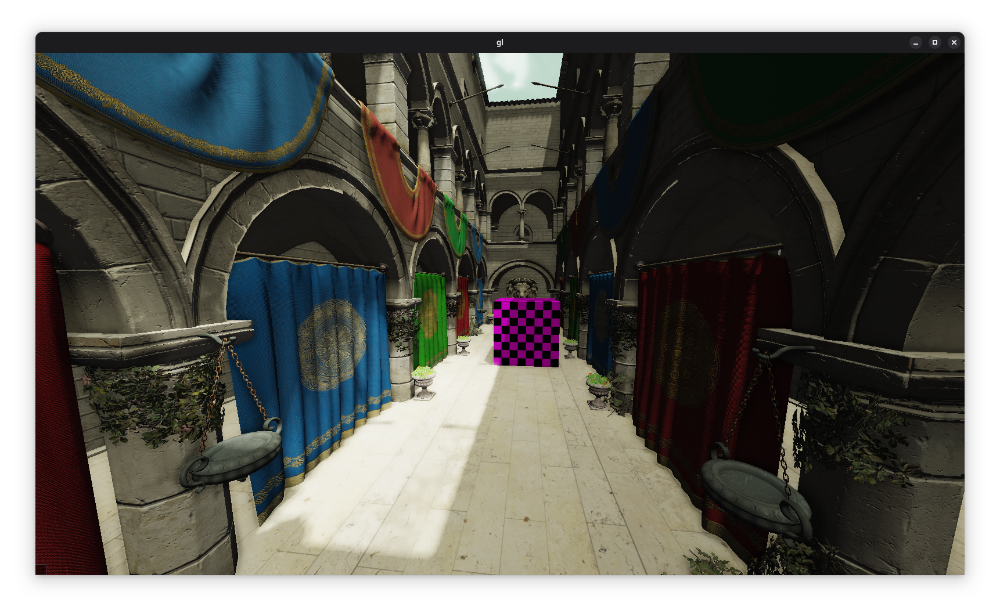

# opengl-engine
An OpenGL game engine written in C++.


## Features
* SSAO
* Deffered rendering
* Water with realtime refraction and reflection
* "Mie scattering" volumetric lighting
* PCF soft shadows with stratified Poisson sampling
* HDR + tonemapping
* Bloom

## Dependencies
```
Debian / Ubuntu: sudo apt install xorg-dev libmesa-dev
Fedora: sudo dnf install libXcursor-devel libXi-devel libXinerama-devel libXrandr-devel
        sudo dnf install mesa-libGL-devel (maybe - todo: check)
```

## Building
```
mkdir build
cd build
cmake .. -G Ninja
ninja
```

## Included libraries
* [glfw-3.3.8](https://github.com/glfw/glfw)
* [glm-0.9.9.8](https://github.com/g-truc/glm)
* [stb_image](https://github.com/nothings/stb/blob/master/stb_image.h)
* [glad](https://glad.dav1d.de/)
* [assimp](https://github.com/assimp/assimp)
  
Please see project pages for respective licenses.
